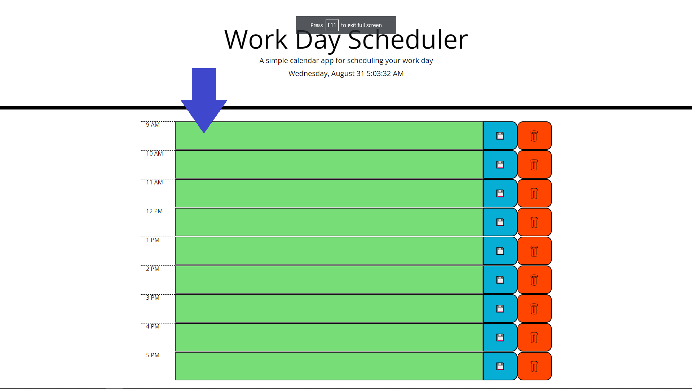
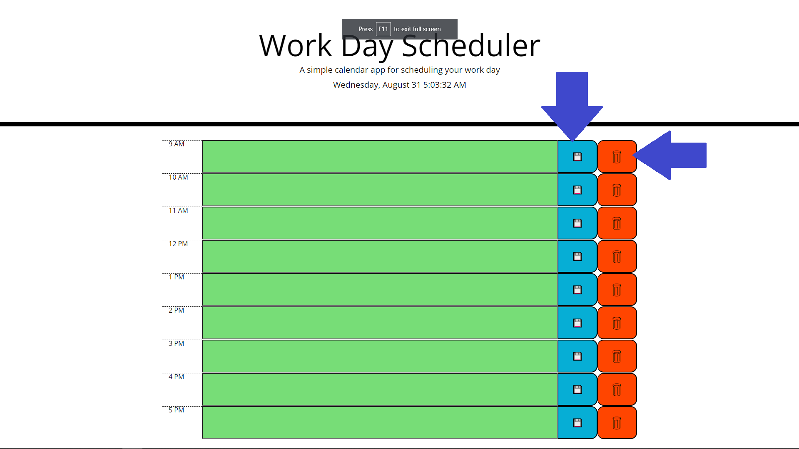

# <Cool-Work-Day-Scheduler>

## Description

- I built this so people can better organize their schedule.
- I got to learn how the transition property can be used to make buttons be animated as you hover over them.
- I also had to learn day.js, and that I need to use the 'dayjs.get()' command or else it will give me a string and not a number.

## Table of Contents (Optional)

Link: https://justinsnyder611.github.io/Cool-Work-Day-Scheduler/

- [Installation](#installation)
- [Usage](#usage)
- [Credits](#credits)
- [License](#license)

## Installation

To open the project all you need to do is click the link in the 'Table of Contents' above.

## Usage

You can add an event in your day by clicking one of the green boxes and typing in what your event is.

Then you can hit the blue save button and it will save your event.
If you want to get rid of an event the click the red delete button and it will delete your event.

## Credits

https://day.js.org/docs/en/display/format

## License

MIT License

Copyright (c) [year] [fullname]

Permission is hereby granted, free of charge, to any person obtaining a copy
of this software and associated documentation files (the "Software"), to deal
in the Software without restriction, including without limitation the rights
to use, copy, modify, merge, publish, distribute, sublicense, and/or sell
copies of the Software, and to permit persons to whom the Software is
furnished to do so, subject to the following conditions:

The above copyright notice and this permission notice shall be included in all
copies or substantial portions of the Software.

THE SOFTWARE IS PROVIDED "AS IS", WITHOUT WARRANTY OF ANY KIND, EXPRESS OR
IMPLIED, INCLUDING BUT NOT LIMITED TO THE WARRANTIES OF MERCHANTABILITY,
FITNESS FOR A PARTICULAR PURPOSE AND NONINFRINGEMENT. IN NO EVENT SHALL THE
AUTHORS OR COPYRIGHT HOLDERS BE LIABLE FOR ANY CLAIM, DAMAGES OR OTHER
LIABILITY, WHETHER IN AN ACTION OF CONTRACT, TORT OR OTHERWISE, ARISING FROM,
OUT OF OR IN CONNECTION WITH THE SOFTWARE OR THE USE OR OTHER DEALINGS IN THE
SOFTWARE.